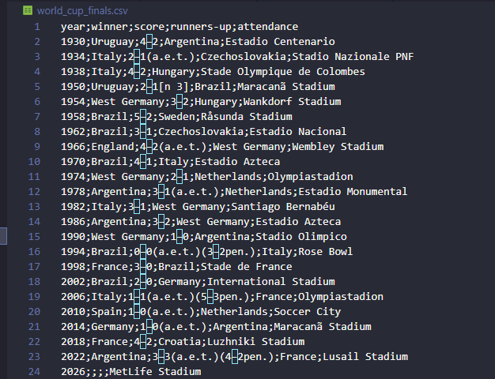
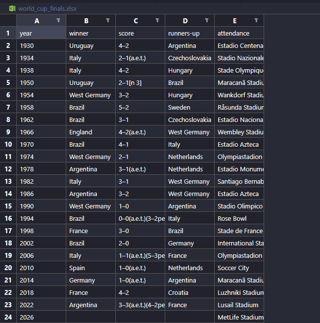

# 🏆 World Cup Finals Web Scraper | Pythonic Effort

Hello! During the World Cup season, I developed a script that extracts data from Wikipedia regarding World Cup finals and saves it into both **CSV** and **XLSX** formats. This project demonstrates my proficiency with **Beautiful Soup** while exploring the history of the world's biggest sporting event.

---

### 🛠️ Features

- **Automated Data Extraction:** Captures Year, Winner, Score, Runner-up, and Attendance.
- **Multi-Format Export:** Supports saving data directly to **Excel (XLSX)** and **CSV** formats.

### 🚀 Why Beautiful Soup and Requests?

- **Requests:** Used to fetch the webpage content. It is significantly faster and more lightweight than running a full browser engine like **Selenium** or **Playwright**.
- **Beautiful Soup:** Chosen for its efficiency in parsing HTML. For static websites, this approach is faster and consumes fewer resources than automated browser bots.

### 📊 Results

| CSV Output | Excel Output |
| :---: | :---: |
|  |  |

*Figure 1: Data successfully scraped and exported.*

### 📋 Setup and Prerequisites

Ensure you have the required libraries installed. Run the following command in your terminal:

```
pip install -r requirements.txt
```

Getting better every day to deliver the best results! I hope you enjoy this project. 🏆 | *Pythonic Effort*
